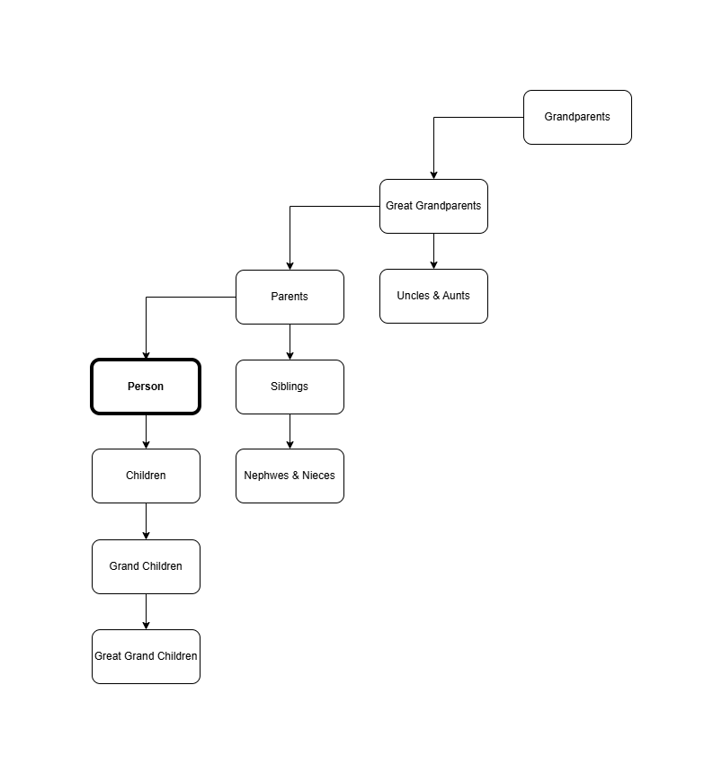

# 'Person': JSON Schema Documentation - for no reason
A comprehensive, structured definition of a human person as a JSON object. This schema is designed to cover the full lifecycle and identity of an individual, from biological data and official documents, to personality, relationships, and life history.

## Table of Contents
1. [Introduction](#introduction)
2. [Overview](#overview)
3. [Extract](#extract)
4. [Design Principles](#design-principles)
5. [Shared Objects](#shared-objects)
6. [Required Fields](#required-fields)
7. [Section Reference](#section-reference)
8. [Practice](#practice)
9. [Summary](#summary)


## Introduction

What if you could represent a person as a JSON object?

Not in a deep sense. Not as an attempt to capture consciousness, measure someone's worth, or answer the questions that matter most (like: what someone truly values, what keeps them up at night, or whether they're at peace with the choices they've made). None of that fits in a schema. A person is not a database record, and this "paper" doesn't pretend otherwise.

But a surprising amount of everyday information does fit. Where someone grew up. What languages they speak. The jobs they've had, the pets they've owned, the books they wrote a note about at midnight. The friend they call Joshy. The first concert that rearranged something in them. The Friday morning ritual that's become quietly sacred.

This is an attempt to model that layer. The retrievable, expressible, shareable part of a person, using the tools a developer would actually reach for. It is meant to be useful, occasionally interesting, and taken lightly. It covers 25 sections, two shared objects, and one example person.

It will not tell you what friendship means to someone. It will not tell you whether someone has a true calling, or whether they'd rather spend a day at an art museum or on a backcountry trail. For those questions, you have to ask.

Lastly, if you find yourself asking about the deeper meaning or grand purpose of this pape... well, there isn't one. It is simply an amusing way to represent a person in JSON format, and nothing more

## Overview

The **Person** object is a single JSON document that represents a human being in full fidelity. It is intended to be:

- **Universal** — applicable to any nationality, culture, religion, or background
- **Extensible** — the `custom` field allows domain-specific additions without breaking the schema
- **Relational** — family members and partners are linked by GUID, enabling graph traversal across a dataset of Person records
- **Lifecycle-aware** — tracks a person from birth to death, including all major life events in between


---

## Extract

A snapshot of the 25 top-level sections and the two shared objects, for quick orientation.

| # | Section | Core purpose |
|---|---------|-------------|
| 1 | `id` | GUID — unique record identifier |
| 2 | `meta` | Record provenance — created, updated, version, source, tags |
| 3 | `name` | Full name with prefix, suffix, maiden, nicknames, transliterations |
| 4 | `birth` | Date, time, place, registration |
| 5 | `death` | Date, place, cause, manner, burial — `null` for living |
| 6 | `biological` | Sex, gender, blood, appearance, genetics, anatomy, health |
| 7 | `identity` | Nationalities, ID documents, biometrics |
| 8 | `origin` | Ethnicity, religion, ancestry, caste |
| 9 | `languages` | Languages spoken with proficiency and script |
| 10 | `contact` | Email, phone, addresses, social media |
| 11 | `education` | Academic history |
| 12 | `career` | Employment history |
| 13 | `affiliations` | Non-payroll memberships and roles |
| 14 | `family` | Partner, past partners, full 3rd-degree family tree |
| 15 | `connections` | Social graph — everyone outside the family tree |
| 16 | `residency` | Address history |
| 17 | `skills` | Competencies with proficiency and certifications |
| 18 | `personality` | Traits, values, MBTI, Big Five, interests, quirks |
| 19 | `biography` | Narrative, milestones, military, criminal record, immigration |
| 20 | `financial` | Income bracket, net worth, credit score, bank accounts |
| 21 | `digital` | Usernames, websites, PGP key |
| 22 | `notes` | Free-form annotations with author, date, category |
| 23 | `custom` | Open key-value extension for any domain-specific fields |
| 24 | `pets` | Animals with lifecycle dates |
| 25 | `ownership` | Physical and non-physical assets |
|  | `Address` | Shared object used wherever a physical location appears |
|  | `Other` | Shared object used wherever an enum includes `"other"` |


## Design Principles

**Identity is multi-layered.** A person has a biological identity, a legal identity, a cultural identity, and a personal identity. This schema treats each layer as a distinct section rather than flattening them together.

**Names are complex.** Across cultures, names carry prefixes, suffixes, maiden names, patronymics, and non-Latin scripts. The `name` object models this richly rather than reducing everything to `firstName` / `lastName`.

**Relationships are references, not embeddings.** Family members and partners are stored as GUID references to other Person records, not as nested objects. This keeps the graph clean and avoids data duplication.

**Null is meaningful.** A `null` value (e.g. `death: null`) explicitly means "not applicable yet" — it is different from a missing field, which means "unknown or not collected."

**Sensitive data is labelled.** Fields like national IDs, passport numbers, tax IDs, and financial data are grouped into their own sections so they can be encrypted, redacted, or access-controlled independently.

### Standards Used

The schema relies on established international standards throughout to ensure interoperability and consistency:

| Standard             | Used for                                         |
|----------------------|--------------------------------------------------|
| GUID                 | `id`, all `person_id` references                 |
| ISO 8601             | All dates (`YYYY-MM-DD`) and datetimes           |
| ISO 3166-1 alpha-2   | Country codes (e.g. `IL`, `US`, `GB`)            |
| IETF BCP 47          | Language codes (e.g. `he-IL`, `en-US`, `fr-FR`)  |
| E.164                | Phone numbers (e.g. `+972501234567`)             |
| ISO 4217             | Currency codes (e.g. `USD`, `ILS`, `EUR`)        |
| ICD-10               | International medical disease codes (e.g. `J45.20`)|
| ICAO 9303            | Passport MRZ format                              |

## Shared Objects
### `Address`

The `Address` object is defined once and reused throughout the schema wherever a physical location is required. This ensures a consistent structure for every place reference — birth location, death site, place of burial, home address, employer, school, and life milestones.

| Field          | Type               | Required | Description                                                                 |
|----------------|--------------------|----------|-----------------------------------------------------------------------------|
| `city`         | `string`           | No    | City or town name                                                           |
| `region`       | `string`           | No    | State, province, county, or district                                        |
| `country`      | `string`           | No    | Full country name                                                           |
| `country_code` | `string`           | No    | ISO 3166-1 alpha-2 (e.g. `IL`, `US`, `FR`, `GB`)                           |
| `coordinates`  | `object`           | No    | `{ lat, lng }` — WGS84 decimal degrees                                      |
| `ZIP_code`     | `string`           | No    | Postal / ZIP code                                                           |
| `addition`     | `string` or `null` | No    | Any extra detail that doesn't fit above: building name, hospital, cemetery, floor, suite, landmark, etc. `null` if not applicable. |

**Example — hospital birth:**
```json
{
  "city": "Tel Aviv",
  "region": "Tel Aviv District",
  "country": "Israel",
  "country_code": "IL",
  "coordinates": { "lat": 32.0853, "lng": 34.7818 },
  "ZIP_code": "6423906",
  "addition": "Ichilov Hospital"
}
```

**Example — university campus:**
```json
{
  "city": "Cambridge",
  "region": "Massachusetts",
  "country": "United States",
  "country_code": "US",
  "coordinates": { "lat": 42.3601, "lng": -71.0942 },
  "ZIP_code": "02139",
  "addition": "Massachusetts Institute of Technology"
}
```

**Example — cemetery (burial):**
```json
{
  "city": "Tel Aviv",
  "region": "Tel Aviv District",
  "country": "Israel",
  "country_code": "IL",
  "coordinates": { "lat": 32.0741, "lng": 34.7801 },
  "ZIP_code": "6473421",
  "addition": "Trumpeldor Cemetery, Section 4"
}
```

**Example — no extra detail needed (`addition: null`):**
```json
{
  "city": "London",
  "region": "England",
  "country": "United Kingdom",
  "country_code": "GB",
  "coordinates": { "lat": 51.5074, "lng": -0.1278 },
  "ZIP_code": "N1C 4AG",
  "addition": null
}
```

The `Address` object is referenced via `$ref: "#/$defs/Address"` in the JSON Schema. Every section that previously had inline `city`/`country` fields now uses this shared definition.

---

### `Other`

The `Other` object is used wherever a field or enum includes an `"other"` option. Rather than leaving `"other"` as a bare string with no context, it pairs the value with an optional human-readable `description` that explains what "other" means **in that specific situation**.

| Field         | Type               | Required | Description |
|---------------|--------------------|----------|-------------|
| `value`       | `string`           | Yes   | Always the literal string `"other"` |
| `description` | `string` or `null` | No    | Explains what "other" means in this specific context. `null` if no further detail is available. |

**Example — contact address type:**
```json
{
  "value": "other",
  "description": "Seasonal holiday home"
}
```

**Example — discharge type with no extra detail:**
```json
{
  "value": "other",
  "description": null
}
```

**Example — distinguishing mark type:**
```json
{
  "value": "other",
  "description": "Vitiligo patch on right forearm"
}
```

The `Other` object is referenced via `$ref: "#/$defs/Other"` in the JSON Schema wherever an enum contains `"other"` as a possible value.

---

## Required Fields

Only three fields are required at the root level. Everything else is optional and can be collected incrementally.

| Field   | Type     | Description                          |
|---------|----------|--------------------------------------|
| `id`    | `string` | GUID unique identifier            |
| `name`  | `object` | Must include at least `given` and `family` |
| `birth` | `object` | Must include at least `date`         |

---

## Section Reference

### 1. `id`

The globally unique identifier for this person record. Uses GUID (Globally Unique Identifier) format.

```json
"id": "a3f4c2d1-58b7-4e9a-bc12-7d3e8f901234"
```

This ID is the primary key used when other Person records reference this individual in family trees or relationship links.

---

### 2. `meta`

Metadata about the record itself — not about the person. Used for auditing, versioning, and data provenance.

| Field        | Type       | Description                                     |
|--------------|------------|-------------------------------------------------|
| `created_at` | `datetime` | When this record was first created              |
| `updated_at` | `datetime` | When this record was last modified              |
| `version`    | `integer`  | Increments on each update                       |
| `source`     | `string`   | Data origin (e.g. `civil_registry`, `self_reported`) |
| `tags`       | `string[]` | Free-form labels for filtering or grouping      |

**Example:**
```json
"meta": {
  "created_at": "2024-01-15T09:00:00Z",
  "updated_at": "2025-03-01T14:22:00Z",
  "version": 4,
  "source": "civil_registry",
  "tags": ["verified", "dual-national", "researcher"]
}
```

---

### 3. `name`

A full structured breakdown of the person's name. Designed to accommodate naming conventions from all cultures.

| Field               | Type       | Description                                                   |
|---------------------|------------|---------------------------------------------------------------|
| `prefix`            | `string`   | Honorific — Mr / Mrs / Dr / Prof / Sir / HRH / etc.           |
| `given`             | `string`   | **Required.** First / given / personal name                   |
| `middle`            | `string[]` | One or more middle names                                      |
| `family`            | `string`   | **Required.** Last / surname / family name                    |
| `suffix`            | `string`   | Post-nominal — Jr. / Sr. / III / PhD / OBE / etc.             |
| `maiden`            | `string`   | Birth surname before marriage or legal name change            |
| `preferred`         | `string`   | The name the person actually prefers to be called             |
| `nickname`          | `object[]` | Informal names — each with the nickname itself and who uses it (see below) |
| `display`           | `string`   | Full pre-formatted display string (e.g. `Dr. Miriam R. Cohen PhD`) |
| `transliterations`  | `object[]` | Name written in other scripts (Hebrew, Arabic, Cyrillic, Kanji, etc.) |

Each `nickname` entry is an object with three fields:

| Field       | Type       | Required | Description                                                                 |
|-------------|------------|----------|-----------------------------------------------------------------------------|
| `value`     | `string`   | Yes   | The nickname itself                                                         |
| `context`   | `string` or `null` | No | A descriptive label for the setting in which this nickname is used (e.g. `"family"`, `"colleagues"`, `"childhood friends"`). Can be `null` if not known. |
| `called_by` | `guid[]`   | Yes   | Array of GUIDs referencing the Person records of those who use this nickname. Minimum one entry. |

**Example:**
```json
"name": {
  "prefix": "Dr.",
  "given": "Miriam",
  "middle": ["Rachel"],
  "family": "Cohen",
  "maiden": "Levi",
  "preferred": "Miri",
  "nickname": [
    {
      "value": "Miri",
      "context": "family",
      "called_by": [
        "e0f4d7h5-24g6-7i5d-bh89-7d5e0f6g1234",
        "d9e3c6g4-13f5-6h4c-ag78-6c4d9e5f0123"
      ]
    },
    {
      "value": "Rachi",
      "context": null,
      "called_by": [
        "b7c1a4e2-91d3-4f2a-8e56-4a2b7c3d8901"
      ]
    },
    {
      "value": "Prof M",
      "context": "colleagues",
      "called_by": [
        "f1g5e8i6-35h7-8j6e-ci90-8e6f1g7h2345",
        "g2h6f9j7-46i8-9k7f-dj01-9f7g2h8i3456"
      ]
    },
    {
      "value": "Mimi",
      "context": "childhood friends",
      "called_by": [
        "l7m1k4o2-91n3-4p2k-io56-4k2l7m3n8901"
      ]
    }
  ],
  "display": "Dr. Miriam Rachel Cohen PhD",
  "transliterations": [
    { "script": "Hebrew", "value": "מרים רחל כהן" }
  ]
}
```

---

### 4. `birth`

Where and when the person was born. Required for the record to be valid.

| Field                 | Type      | Description                                         |
|-----------------------|-----------|-----------------------------------------------------|
| `date`                | `date`    | **Required.** ISO 8601 date of birth (YYYY-MM-DD)   |
| `time`                | `time`    | Time of birth (HH:MM:SS)                            |
| `place.type`          | `string`  | Type of birth location — e.g. `hospital`, `home`, `clinic`, `unknown` |
| `place.address`       | `Address` | Full Address object for the birth location          |
| `registration_number` | `string`  | Official birth certificate / civil registration ID  |
| `is_estimated`        | `boolean` | `true` if the date is approximate (historical records, etc.) |

**Example:**
```json
"birth": {
  "date": "1985-06-14",
  "time": "07:42:00",
  "place": {
    "type": "hospital",
    "address": {
      "city": "Tel Aviv",
      "region": "Tel Aviv District",
      "country": "Israel",
      "country_code": "IL",
      "coordinates": { "lat": 32.0853, "lng": 34.7818 },
      "ZIP_code": "6423906",
      "addition": "Ichilov Hospital"
    }
  },
  "registration_number": "IL-1985-TLV-088421",
  "is_estimated": false
}
```

---

### 5. `death`

Records the person's death. Set to `null` for living persons.

| Field            | Type      | Description                                                  |
|------------------|-----------|--------------------------------------------------------------|
| `date`           | `date`    | Date of death                                                |
| `time`           | `time`    | Time of death                                                |
| `place_of_death` | `Address` | Full Address object for where the person died                |
| `cause`          | `string`  | Medical cause of death (free text or ICD code)               |
| `manner`         | `enum`    | `natural` / `accident` / `homicide` / `suicide` / `undetermined` / `unknown` |
| `buried_at`      | `Address` | Full Address object for burial or interment site             |

**Example (deceased person):**
```json
"death": {
  "date": "2071-11-03",
  "time": "22:15:00",
  "place_of_death": {
    "city": "Tel Aviv",
    "region": "Tel Aviv District",
    "country": "Israel",
    "country_code": "IL",
    "coordinates": { "lat": 32.0853, "lng": 34.7818 },
    "ZIP_code": "6423906",
    "addition": "Ichilov Hospital, ICU Ward"
  },
  "cause": "Cardiac arrest",
  "manner": "natural",
  "buried_at": {
    "city": "Tel Aviv",
    "region": "Tel Aviv District",
    "country": "Israel",
    "country_code": "IL",
    "coordinates": { "lat": 32.0741, "lng": 34.7801 },
    "ZIP_code": "6473421",
    "addition": "Trumpeldor Cemetery, Section 4"
  }
}
```

**Example (living person):**
```json
"death": null
```

---

### 6. `biological`

The physical, biological, and medical characteristics of the person. Divided into sub-sections.

#### 6a. Sex & Gender

| Field             | Type       | Description                                          |
|-------------------|------------|------------------------------------------------------|
| `sex_at_birth`    | `enum`     | `male` / `female` / `intersex` / `unknown`           |
| `gender_identity` | `string`   | Self-identified gender (free text)                   |
| `pronouns`        | `string[]` | e.g. `["she/her"]`, `["they/them"]`, `["he/him"]`    |

#### 6b. Blood

| Field       | Type   | Description                           |
|-------------|--------|---------------------------------------|
| `type`      | `enum` | `A` / `B` / `AB` / `O` / `unknown`   |
| `rh_factor` | `enum` | `+` / `-` / `unknown`                |
| `display`   | `string` | Combined display, e.g. `A+`, `O-`  |

#### 6c. Appearance

| Field                 | Type       | Description                                        |
|-----------------------|------------|----------------------------------------------------|
| `height_cm`           | `number`   | Height in centimetres                              |
| `weight_kg`           | `number`   | Weight in kilograms                                |
| `eye_color`           | `string`   | Eye colour                                         |
| `hair_color`          | `string`   | Hair colour                                        |
| `hair_texture`        | `string`   | e.g. straight, wavy, curly, coily                  |
| `skin_tone`           | `string`   | Descriptive or Fitzpatrick scale                   |
| `build`               | `string`   | e.g. slim, athletic, stocky                        |
| `distinguishing_marks` | `object[]` | Tattoos, scars, birthmarks, piercings — with type, location, and description |

#### 6d. Genetics

| Field                    | Type       | Description                                                 |
|--------------------------|------------|-------------------------------------------------------------|
| `dna_profile_id`         | `string`   | Reference to a stored DNA profile                           |
| `haplogroup_paternal`    | `string`   | Y-DNA haplogroup (paternal line)                            |
| `haplogroup_maternal`    | `string`   | mtDNA haplogroup (maternal line)                            |
| `known_variants`         | `string[]` | Notable genetic variants (e.g. `BRCA1`, `MTHFR C677T`)     |
| `ancestry_composition`   | `object[]` | Array of `{ region, percentage }` from ancestry testing     |

#### 6e. Anatomy

| Field            | Type       | Description                                          |
|------------------|------------|------------------------------------------------------|
| `dominant_hand`  | `enum`     | `right` / `left` / `ambidextrous`                    |
| `organ_donor`    | `boolean`  | Whether registered as an organ donor                 |
| `disabilities`   | `string[]` | Physical or sensory disabilities                     |
| `prosthetics`    | `string[]` | Any prosthetic limbs or implants                     |

#### 6f. Health

| Field          | Type       | Description                                                    |
|----------------|------------|----------------------------------------------------------------|
| `conditions`   | `object[]` | Medical conditions with name, ICD code, diagnosis date, and status (`active` / `chronic` / `resolved` / `in_remission`) |
| `allergies`    | `string[]` | Known allergies (medications, foods, environmental)            |
| `vaccinations` | `object[]` | Vaccination history with name, date, and booster flag          |

**Example:**
```json
"biological": {
  "sex_at_birth": "female",
  "gender_identity": "woman",
  "pronouns": ["she/her"],
  "blood": { "type": "A", "rh_factor": "+", "display": "A+" },
  "appearance": {
    "height_cm": 167,
    "weight_kg": 62,
    "eye_color": "brown",
    "hair_color": "dark brown",
    "hair_texture": "wavy",
    "skin_tone": "olive",
    "build": "athletic",
    "distinguishing_marks": [
      { "type": "birthmark", "location": "left shoulder", "description": "small oval birthmark" },
      { "type": "tattoo", "location": "right wrist", "description": "small olive branch" }
    ]
  },
  "genetics": {
    "dna_profile_id": "DNA-2019-IL-44821",
    "haplogroup_paternal": "J2a",
    "haplogroup_maternal": "K1a",
    "known_variants": ["MTHFR C677T"],
    "ancestry_composition": [
      { "region": "Levantine", "percentage": 62 },
      { "region": "Ashkenazi Jewish", "percentage": 28 },
      { "region": "Southern European", "percentage": 10 }
    ]
  },
  "anatomy": {
    "dominant_hand": "right",
    "organ_donor": true,
    "disabilities": [],
    "prosthetics": []
  },
  "health": {
    "conditions": [
      { "name": "Mild Asthma", "icd_code": "J45.20", "diagnosed": "1998-03-10", "status": "chronic" }
    ],
    "allergies": ["penicillin", "shellfish"],
    "vaccinations": [
      { "name": "COVID-19 (Pfizer)", "date": "2021-02-20", "booster": false },
      { "name": "COVID-19 Booster", "date": "2021-10-05", "booster": true }
    ]
  }
}
```

---

### 7. `identity`

Official government-issued documents and legal identity records. This is the most sensitive section.

#### 7a. Nationalities

An array of citizenships. A person may hold multiple nationalities.

| Field          | Type   | Description                                                            |
|----------------|--------|------------------------------------------------------------------------|
| `country`      | `string` | Country name                                                         |
| `country_code` | `string` | ISO 3166-1 alpha-2                                                   |
| `acquired_by`  | `enum` | `birth` / `descent` / `naturalization` / `marriage` / `registration` |
| `since`        | `date` | Date nationality was acquired                                          |

#### 7b. National ID

Each country has its own national identifier system. This field is an array to support dual nationals.

| Field     | Type   | Description                                                   |
|-----------|--------|---------------------------------------------------------------|
| `country` | `string` | Issuing country                                             |
| `type`    | `string` | ID type name — e.g. `Teudat Zehut` (IL), `SSN` (US), `Aadhaar` (IN), `NIN` (UK), `CPF` (BR) |
| `number`  | `string` | The ID number (store encrypted)                             |
| `issued`  | `date`   | Issue date                                                  |
| `expires` | `date` or `null` | Expiry date; `null` if it doesn't expire          |

#### 7c. Passport

Array of passports (one per nationality typically, but some people hold more).

| Field       | Type   | Description                                     |
|-------------|--------|-------------------------------------------------|
| `country`   | `string` | Issuing country                               |
| `number`    | `string` | Passport number                               |
| `issued`    | `date`   | Issue date                                    |
| `expires`   | `date`   | Expiry date                                   |
| `issued_at` | `string` | Issuing authority / location                  |
| `mrz`       | `string` | Machine Readable Zone string (2-line MRZ)     |

#### 7d. Driver's License

| Field          | Type       | Description                              |
|----------------|------------|------------------------------------------|
| `country`      | `string`   | Issuing country                          |
| `state_region` | `string`   | State or province (where applicable)     |
| `number`       | `string`   | License number                           |
| `class`        | `string`   | License class (e.g. `B`, `C`, `CDL`)     |
| `issued`       | `date`     | Issue date                               |
| `expires`      | `date`     | Expiry date                              |
| `restrictions` | `string[]` | Any restrictions (e.g. corrective lenses) |

#### 7e. Tax IDs

| Field     | Type   | Description                                          |
|-----------|--------|------------------------------------------------------|
| `country` | `string` | Country of tax registration                        |
| `type`    | `string` | e.g. `TIN`, `VAT`, `EIN`, `GST Number`             |
| `number`  | `string` | Tax ID number                                      |

#### 7f. Biometrics

| Field                    | Type      | Description                             |
|--------------------------|-----------|-----------------------------------------|
| `fingerprints_on_file`   | `boolean` | Whether fingerprints are registered     |
| `facial_recognition_id`  | `string`  | Reference to facial biometric profile   |
| `iris_scan_id`           | `string`  | Reference to iris scan profile          |

**Example:**
```json
"identity": {
  "nationalities": [
    { "country": "Israel", "country_code": "IL", "acquired_by": "birth", "since": "1985-06-14" },
    { "country": "United States", "country_code": "US", "acquired_by": "descent", "since": "1985-07-01" }
  ],
  "national_id": [
    { "country": "Israel", "type": "Teudat Zehut", "number": "123456782", "issued": "2003-06-14", "expires": null }
  ],
  "passport": [
    { "country": "Israel", "number": "20XXXXXXX", "issued": "2022-01-10", "expires": "2032-01-09", "issued_at": "Ministry of Interior, Tel Aviv" },
    { "country": "United States", "number": "5XXXXXXXX", "issued": "2019-05-22", "expires": "2029-05-21", "issued_at": "US Embassy, Tel Aviv" }
  ],
  "drivers_license": [
    { "country": "Israel", "number": "IL-DL-7884210", "class": "B", "issued": "2005-08-01", "expires": "2030-08-01", "restrictions": [] }
  ],
  "tax_ids": [
    { "country": "Israel", "type": "TIN", "number": "123456782" },
    { "country": "United States", "type": "SSN", "number": "XXX-XX-XXXX" }
  ],
  "biometrics": {
    "fingerprints_on_file": true,
    "facial_recognition_id": "FR-IL-20220110-44821",
    "iris_scan_id": null
  }
}
```

---

### 8. `origin`

Cultural, ethnic, geographic, and religious background. Represents who the person is in terms of heritage and belief.

| Field               | Type       | Description                                                           |
|---------------------|------------|-----------------------------------------------------------------------|
| `ethnicity`         | `string[]` | Self-identified ethnic groups (can be multiple)                       |
| `tribal_clan`       | `string`   | Tribal or clan affiliation (relevant in many cultures)                |
| `ancestral_homeland`| `string`   | Geographic region of family origin                                    |
| `caste_social_class`| `string`   | Caste or traditional social class (where culturally applicable)       |

#### Religion sub-object

| Field          | Type   | Description                                                                |
|----------------|--------|----------------------------------------------------------------------------|
| `primary`      | `string` | Religion name (e.g. `Judaism`, `Islam`, `Christianity`, `Hinduism`)      |
| `denomination` | `string` | Branch or sect (e.g. `Conservative`, `Sunni`, `Catholic`, `Vaishnavism`) |
| `observance`   | `enum` | `secular` / `cultural` / `practicing` / `devout` / `none` / `unknown`     |
| `converted`    | `boolean` | Whether the person converted to this religion                           |

**Example:**
```json
"origin": {
  "ethnicity": ["Mizrahi Jewish", "Ashkenazi Jewish"],
  "tribal_clan": "Tribe of Levi (traditional)",
  "ancestral_homeland": "Levant / Eastern Europe",
  "religion": {
    "primary": "Judaism",
    "denomination": "Conservative",
    "observance": "practicing",
    "converted": false
  },
  "caste_social_class": null
}
```

---

### 9. `languages`

An array of all languages a person speaks, reads, or writes. Each entry captures four skill dimensions separately.

| Field         | Type     | Description                                                          |
|---------------|----------|----------------------------------------------------------------------|
| `language`    | `string` | **Required.** Language name (e.g. `Hebrew`, `English`, `Mandarin`)  |
| `bcp47_code`  | `string` | IETF BCP 47 code (e.g. `he-IL`, `en-US`, `zh-TW`)                  |
| `proficiency` | `enum`   | **Required.** Overall level: `native` / `fluent` / `advanced` / `intermediate` / `basic` / `learning` |
| `skills`      | `object` | Granular breakdown of `speaking`, `reading`, `writing`, `listening` — each with its own proficiency level |
| `is_native`   | `boolean`| Whether this is a native / mother tongue                             |
| `script`      | `string` | Writing system used (e.g. `Latin`, `Hebrew`, `Arabic`, `Cyrillic`, `Kanji`) |

**Example:**
```json
"languages": [
  {
    "language": "Hebrew",
    "bcp47_code": "he-IL",
    "proficiency": "native",
    "skills": { "speaking": "native", "reading": "native", "writing": "native", "listening": "native" },
    "is_native": true,
    "script": "Hebrew"
  },
  {
    "language": "English",
    "bcp47_code": "en-US",
    "proficiency": "fluent",
    "skills": { "speaking": "fluent", "reading": "native", "writing": "fluent", "listening": "native" },
    "is_native": false,
    "script": "Latin"
  },
  {
    "language": "French",
    "bcp47_code": "fr-FR",
    "proficiency": "intermediate",
    "skills": { "speaking": "intermediate", "reading": "advanced", "writing": "intermediate", "listening": "intermediate" },
    "is_native": false,
    "script": "Latin"
  }
]
```

---

### 10. `contact`

How to reach the person, and where they live now and historically.

#### Email

Array of email addresses, each with type (`personal` / `work` / `other`), a verified flag, and a primary flag.

#### Phone

Array of phone numbers. Stored both in local format and **E.164** international format (e.g. `+972501234567`). Types: `mobile` / `home` / `work` / `fax` / `other`.

#### Addresses

Full address history. Each entry wraps an `Address` object with period metadata:

| Field        | Type      | Description                                              |
|--------------|-----------|----------------------------------------------------------|
| `type`       | `enum`    | `home` / `work` / `mailing` / `previous` / `other`      |
| `address`    | `Address` | Full Address object (see Shared Object section)          |
| `from`       | `date`    | Date moved in                                            |
| `to`         | `date` or `null` | Date moved out (`null` = still living there)     |
| `is_current` | `boolean` | Whether this is the current address                      |

**Example (contact section):**
```json
"contact": {
  "email": [
    { "address": "miriam.cohen@example.com", "type": "personal", "verified": true, "primary": true },
    { "address": "m.cohen@university.ac.il", "type": "work", "verified": true, "primary": false }
  ],
  "phone": [
    { "number": "050-123-4567", "e164": "+972501234567", "type": "mobile", "primary": true }
  ],
  "addresses": [
    {
      "type": "home",
      "address": {
        "city": "Tel Aviv",
        "region": "Tel Aviv District",
        "country": "Israel",
        "country_code": "IL",
        "coordinates": { "lat": 32.0635, "lng": 34.7743 },
        "ZIP_code": "6688101",
        "addition": "12 Rothschild Blvd, Apt 4B"
      },
      "from": "2018-09-01",
      "to": null,
      "is_current": true
    }
  ],
  "social_media": [
    { "platform": "LinkedIn", "handle": "miriamcohen", "url": "https://linkedin.com/in/miriamcohen", "verified": false }
  ]
}
```

#### Social Media

Array of platform handles. Each entry includes platform name, handle, URL, and a verified flag.

---

### 11. `education`

Full academic history as an array of institutions attended.

| Field       | Type      | Description                                                     |
|-------------|-----------|-----------------------------------------------------------------|
| `institution`| `string` | Name of school, university, or institute                        |
| `type`      | `enum`    | `primary` / `secondary` / `vocational` / `undergraduate` / `graduate` / `doctorate` / `postdoc` / `other` |
| `field`     | `string`  | Field of study                                                  |
| `degree`    | `string`  | Degree awarded (e.g. `B.Sc.`, `M.A.`, `PhD`)                   |
| `start`/`end` | `date`  | Enrollment period (`end: null` = ongoing)                       |
| `graduated` | `boolean` | Whether the person graduated / completed the program            |
| `gpa`       | `number`  | Grade point average                                             |
| `honors`    | `string`  | Academic honors (e.g. `Magna Cum Laude`, `First Class`)         |
| `location`  | `Address` | Address object for the institution                              |

**Example:**
```json
"education": [
  {
    "institution": "Hebrew University of Jerusalem",
    "type": "undergraduate",
    "field": "Computer Science",
    "degree": "B.Sc.",
    "start": "2003-10-01",
    "end": "2007-06-30",
    "graduated": true,
    "gpa": 3.8,
    "honors": "Magna Cum Laude",
    "location": {
      "city": "Jerusalem",
      "region": "Jerusalem District",
      "country": "Israel",
      "country_code": "IL",
      "coordinates": { "lat": 31.7767, "lng": 35.2345 },
      "ZIP_code": "9190401",
      "addition": "Hebrew University of Jerusalem, Mount Scopus"
    }
  },
  {
    "institution": "MIT",
    "type": "doctorate",
    "field": "Cognitive Science & AI",
    "degree": "PhD",
    "start": "2009-09-01",
    "end": "2014-05-31",
    "graduated": true,
    "gpa": 4.0,
    "location": {
      "city": "Cambridge",
      "region": "Massachusetts",
      "country": "United States",
      "country_code": "US",
      "coordinates": { "lat": 42.3601, "lng": -71.0942 },
      "ZIP_code": "02139",
      "addition": "Massachusetts Institute of Technology"
    }
  }
]
```

---

### 12. `career`

Employment history as an ordered array.

| Field        | Type      | Description                                                  |
|--------------|-----------|--------------------------------------------------------------|
| `employer`   | `string`  | Organisation or company name                                 |
| `title`      | `string`  | Job title or role                                            |
| `industry`   | `string`  | Sector (e.g. `Technology`, `Academia`, `Finance`, `Military`)|
| `start`/`end`| `date`    | Employment period (`end: null` for current role)             |
| `is_current` | `boolean` | Flags the current position                                   |
| `description`| `string`  | Summary of responsibilities or achievements                  |
| `location`   | `Address` | Address object for the employer                              |

**Example:**
```json
"career": [
  {
    "employer": "Tel Aviv University",
    "title": "Associate Professor of Cognitive Science",
    "industry": "Academia",
    "start": "2017-10-01",
    "end": null,
    "is_current": true,
    "description": "Research in human-AI interaction and cognitive load theory.",
    "location": {
      "city": "Tel Aviv",
      "region": "Tel Aviv District",
      "country": "Israel",
      "country_code": "IL",
      "coordinates": { "lat": 32.1133, "lng": 34.8044 },
      "ZIP_code": "6997801",
      "addition": "Tel Aviv University, Ramat Aviv"
    }
  },
  {
    "employer": "Google DeepMind",
    "title": "Research Scientist",
    "industry": "Technology",
    "start": "2014-07-01",
    "end": "2017-09-30",
    "is_current": false,
    "description": "Worked on reinforcement learning and human-computer interaction.",
    "location": {
      "city": "London",
      "region": "England",
      "country": "United Kingdom",
      "country_code": "GB",
      "coordinates": { "lat": 51.5074, "lng": -0.1278 },
      "ZIP_code": "N1C 4AG",
      "addition": "Google DeepMind, Kings Cross"
    }
  }
]
```

---

### 13. `affiliations`

Memberships, roles, and participation in organisations that are **not paid employment**. This covers everything from professional bodies and alumni networks to sports clubs, volunteering, political parties, and religious groups.

This section is distinct from `career` (which is payroll-based) but may overlap with it for people who hold advisory, board, or honorary positions.

| Field          | Type       | Required | Description |
|----------------|------------|----------|-------------|
| `organisation` | `string`   | Yes   | Name of the organisation or group |
| `type`         | `enum`     | Yes   | `professional_body` / `club` / `volunteering` / `political` / `religious` / `community` / `alumni` / `union` / `ngo` / `sports` / `arts` / `academic` / `fraternal` / `other` |
| `role`         | `string`   | Yes   | The person's role — e.g. `"member"`, `"board member"`, `"volunteer"`, `"chairperson"` |
| `since`        | `date`     | No    | Date the affiliation began |
| `until`        | `date` or `null` | No | Date it ended. `null` = currently active |
| `is_current`   | `boolean`  | No    | Whether this affiliation is currently active |
| `location`     | `Address`  | No    | Address of the organisation |
| `description`  | `string`   | No    | What the person does or did within this affiliation |

**Example:**
```json
"affiliations": [
  {
    "organisation": "Association for Computing Machinery (ACM)",
    "type": "professional_body",
    "role": "senior member",
    "since": "2015-01-01",
    "until": null,
    "is_current": true,
    "description": "Active member of ACM SIGCHI."
  },
  {
    "organisation": "Leket Israel",
    "type": "volunteering",
    "role": "volunteer",
    "since": "2020-04-01",
    "until": "2022-12-01",
    "is_current": false,
    "description": "Food rescue operations during COVID-19."
  }
]
```

---

### 14. `family`

Romantic and family relationships. All people are referenced by their GUID — they are not embedded.

#### Partner (current)

| Field                     | Type   | Description                                                     |
|---------------------------|--------|-----------------------------------------------------------------|
| `person_id`               | `guid` | GUID of the partner's Person record                             |
| `type`                    | `enum` | `married` / `domestic_partner` / `engaged` / `dating` / `separated` / `divorced` / `widowed` |
| `since`                   | `date` | Start of relationship                                           |
| `until`                   | `date` or `null` | End of relationship (`null` = current)              |
| `marriage_certificate_id` | `string` | Official certificate reference number                         |

#### Past Partners

Same structure as current partner, but as an array of previous relationships.

#### Family Tree

The `tree` object covers relationships up to 3rd degree, with a dedicated array for each relationship type. All members are stored as GUID references — no nested Person objects.

##### Degree reference

| Degree | Arrays |
|--------|--------|
| 1st    | `parents`, `siblings`, `children` |
| 2nd    | `grandparents`, `grandchildren`, `aunts_uncles`, `nephews_nieces` |
| 3rd    | `great_grandparents`, `great_grandchildren`, `cousins` |
| Beyond | `extended` |




##### `parents`
Up to 2 entries. Each has a `person_id` and a `relation` type.

| Field       | Type   | Values |
|-------------|--------|--------|
| `person_id` | `guid` | — |
| `relation`  | `enum` | `biological_mother` / `biological_father` / `adoptive_mother` / `adoptive_father` / `step_mother` / `step_father` / `surrogate` / `guardian` |

##### `grandparents`
Up to 4 entries. Each has a `relation`, a `side`, and a `person_id`.

| Field       | Type   | Values |
|-------------|--------|--------|
| `person_id` | `guid` | — |
| `relation`  | `enum` | `grandmother` / `grandfather` |
| `side`      | `enum` | `maternal` / `paternal` |

##### `great_grandparents`
Up to 8 entries. Each specifies which grandparent `line` they descend from.

| Field       | Type   | Values |
|-------------|--------|--------|
| `person_id` | `guid` | — |
| `relation`  | `enum` | `great_grandmother` / `great_grandfather` |
| `line`      | `enum` | `maternal_maternal` / `maternal_paternal` / `paternal_maternal` / `paternal_paternal` |

##### `siblings`

| Field         | Type      | Values |
|---------------|-----------|--------|
| `person_id`   | `guid`    | — |
| `relation`    | `enum`    | `full_sibling` / `half_sibling` / `step_sibling` / `adoptive_sibling` / `twin` |
| `birth_order` | `integer` | Position among all siblings, 1-indexed |

##### `children`

| Field       | Type   | Values |
|-------------|--------|--------|
| `person_id` | `guid` | — |
| `relation`  | `enum` | `biological` / `adopted` / `step` / `foster` / `surrogate` |

##### `grandchildren`
Includes a `through_child` backlink to trace the lineage.

| Field           | Type   | Values |
|-----------------|--------|--------|
| `person_id`     | `guid` | — |
| `relation`      | `enum` | `biological` / `adopted` / `step` / `foster` |
| `through_child` | `guid` | GUID of the child (1st degree) who is their parent |

##### `great_grandchildren`
Includes a `through_grandchild` backlink.

| Field                | Type   | Values |
|----------------------|--------|--------|
| `person_id`          | `guid` | — |
| `relation`           | `enum` | `biological` / `adopted` / `step` / `foster` |
| `through_grandchild` | `guid` | GUID of the grandchild (2nd degree) who is their parent |

##### `aunts_uncles`
Parents' siblings. Optionally backlinked to the parent who is their sibling.

| Field            | Type   | Values |
|------------------|--------|--------|
| `person_id`      | `guid` | — |
| `relation`       | `enum` | `aunt` / `uncle` |
| `side`           | `enum` | `maternal` / `paternal` |
| `through_parent` | `guid` | GUID of the parent who is their sibling *(optional)* |

##### `nephews_nieces`
Siblings' children. Backlinked to the sibling who is their parent.

| Field             | Type   | Values |
|-------------------|--------|--------|
| `person_id`       | `guid` | — |
| `relation`        | `enum` | `nephew` / `niece` |
| `through_sibling` | `guid` | GUID of the sibling who is their parent |

##### `cousins`
Aunts'/uncles' children. Supports first, second, and removed cousins.

| Field                | Type      | Description |
|----------------------|-----------|-------------|
| `person_id`          | `guid`    | — |
| `degree`             | `integer` | `1` = first cousin, `2` = second cousin, etc. |
| `removed`            | `integer` | Generational offset — `0` = same generation |
| `side`               | `enum`    | `maternal` / `paternal` |
| `through_aunt_uncle` | `guid`    | GUID of the aunt/uncle through whom the cousin is connected *(optional)* |

##### `extended`
Catch-all for any relationship not covered above: great-aunts/uncles, in-laws, godparents, chosen family, step-relationships beyond the defined tiers, etc.

| Field       | Type     | Description |
|-------------|----------|-------------|
| `person_id` | `guid`   | — |
| `relation`  | `string` | Free-text description (e.g. `great_aunt`, `godmother`, `in-law`, `chosen family`) |

> **Design note:** Because all family members are stored as GUID references, you can load any related Person record and traverse the full family graph recursively. The `through_*` backlink fields make it possible to reconstruct lineage paths without traversing the entire graph.

**Example:**
```json
"relationships": {
  "partner": {
    "person_id": "b7c1a4e2-91d3-4f2a-8e56-4a2b7c3d8901",
    "type": "married",
    "since": "2016-07-03",
    "until": null,
    "marriage_certificate_id": "IL-MARR-2016-TLV-00421"
  },
  "past_partners": [
    { "person_id": "c8d2b5f3-02e4-5g3b-9f67-5b3c8d4e9012", "type": "dating", "since": "2010-02-14", "until": "2013-11-30" }
  ],
  "family": {
    "parents": [
      { "person_id": "d9e3c6g4-13f5-6h4c-ag78-6c4d9e5f0123", "relation": "biological_mother" },
      { "person_id": "e0f4d7h5-24g6-7i5d-bh89-7d5e0f6g1234", "relation": "biological_father" }
    ],
    "grandparents": [
      { "person_id": "aa11b22c-1111-2222-3333-444455556666", "relation": "grandmother", "side": "maternal" },
      { "person_id": "bb22c33d-2222-3333-4444-555566667777", "relation": "grandfather", "side": "maternal" },
      { "person_id": "cc33d44e-3333-4444-5555-666677778888", "relation": "grandmother", "side": "paternal" },
      { "person_id": "dd44e55f-4444-5555-6666-777788889999", "relation": "grandfather", "side": "paternal" }
    ],
    "great_grandparents": [
      { "person_id": "ee55f66g-5555-6666-7777-88889999aaaa", "relation": "great_grandmother", "line": "maternal_maternal" },
      { "person_id": "ff66g77h-6666-7777-8888-9999aaaabbbb", "relation": "great_grandfather", "line": "maternal_maternal" }
    ],
    "siblings": [
      { "person_id": "f1g5e8i6-35h7-8j6e-ci90-8e6f1g7h2345", "relation": "full_sibling", "birth_order": 1 },
      { "person_id": "g2h6f9j7-46i8-9k7f-dj01-9f7g2h8i3456", "relation": "full_sibling", "birth_order": 3 }
    ],
    "children": [
      { "person_id": "h3i7g0k8-57j9-0l8g-ek12-0g8h3i9j4567", "relation": "biological" },
      { "person_id": "i4j8h1l9-68k0-1m9h-fl23-1h9i4j0k5678", "relation": "biological" }
    ],
    "grandchildren": [
      { "person_id": "mm33n44o-dddd-eeee-ffff-000011112224", "relation": "biological", "through_child": "h3i7g0k8-57j9-0l8g-ek12-0g8h3i9j4567" }
    ],
    "great_grandchildren": [
      { "person_id": "nn44o55p-eeee-ffff-0000-111122223335", "relation": "biological", "through_grandchild": "mm33n44o-dddd-eeee-ffff-000011112224" }
    ],
    "aunts_uncles": [
      { "person_id": "l7m1k4o2-91n3-4p2k-io56-4k2l7m3n8901", "relation": "aunt", "side": "maternal", "through_parent": "d9e3c6g4-13f5-6h4c-ag78-6c4d9e5f0123" },
      { "person_id": "oo55p66q-ffff-0000-1111-222233334446", "relation": "uncle", "side": "paternal", "through_parent": "e0f4d7h5-24g6-7i5d-bh89-7d5e0f6g1234" }
    ],
    "nephews_nieces": [
      { "person_id": "pp66q77r-0000-1111-2222-333344445557", "relation": "niece", "through_sibling": "f1g5e8i6-35h7-8j6e-ci90-8e6f1g7h2345" }
    ],
    "cousins": [
      { "person_id": "m8n2l5p3-02o4-5q3l-jp67-5l3m8n4o9012", "degree": 1, "removed": 0, "side": "maternal", "through_aunt_uncle": "l7m1k4o2-91n3-4p2k-io56-4k2l7m3n8901" }
    ],
    "extended": [
      { "person_id": "ss99t00u-3333-4444-5555-666677778880", "relation": "godmother" },
      { "person_id": "tt00u11v-4444-5555-6666-777788889991", "relation": "great_aunt" }
    ]
  }
}
```
#### Graph Model

All family members are stored as GUID references rather than embedded objects. This creates a directed graph where nodes are Person records, edges are relationships, and `through_*` backlink fields enable lineage path reconstruction without traversing the entire graph.

```
[Great-Grandparent] ──► [Grandparent] ──► [Parent A] ──── married ────► [Parent B]
                                               │                               │
                              ┌────────────────┴────────────────┐              │
                          [Sibling]                        [This Person] ◄─────┘
                              │                                  │
                         [Nephew/Niece]              ┌──────────┴──────────┐
                                                [Child 1]             [Child 2]
                                                     │
                                              [Grandchild]
                                                     │
                                           [Great-Grandchild]
```

---

### 15. `connections`

The person's social graph — everyone they know who isn't already captured in `family` (which is reserved for romantic partners and family tree). Each entry describes a single connection: who they are, how the connection was formed, how the person feels about them, and how they actually interact.

This section is distinct from `family` in both scope and nature:

- `family` — objective, structural (partners and family tree)
- `connections` — social, attitudinal, and interactional (friends, colleagues, mentors, acquaintances)

**Top-level fields per entry:**

| Field          | Type     | Required | Description |
|----------------|----------|----------|-------------|
| `person_id`    | `guid`   | Yes   | GUID of the connected Person record |
| `given_nickname` | `string` or `null` | No | The informal name this person uses when addressing this connection — e.g. `"Joshy"`, `"Tali"`. Mirrors the corresponding entry in the connected Person's `name.nickname` array, where `called_by` points back to this person's GUID. |
| `role`         | `string` | Yes   | Free-text description — e.g. `"close friend"`, `"coworker"`, `"PhD advisor"`, `"running buddy"` |
| `context`      | `object` | No    | How and where the connection was formed |
| `attitude`     | `object` | No    | Subjective assessment — optional but recommended |
| `interaction`  | `object` | No    | Contact frequency and channels |

**`context` sub-fields:**

| Field     | Type      | Description |
|-----------|-----------|-------------|
| `group`   | `string`  | Social grouping — e.g. `"Work"`, `"School"`, `"Neighborhood"`, `"Online"` |
| `how_met` | `enum`    | `job` / `school` / `mutual_friend` / `online` / `event` / `neighborhood` / `family` / `travel` / `app` / `other` |
| `where`   | `Address` | Full Address object for where they met |
| `since`   | `date`    | Approximate date the connection was established |

**`attitude` sub-fields:**

| Field        | Type       | Description |
|--------------|------------|-------------|
| `as_of`      | `date`     | When this assessment was last updated |
| `valence`    | `enum`     | `positive` / `neutral` / `negative` / `mixed` / `unknown` |
| `score`      | `number`   | `-1.0` = strongly negative · `0` = neutral · `+1.0` = strongly positive |
| `dimensions` | `object`   | Granular scores 0.0–1.0: `trust`, `respect`, `closeness`, `influence` |
| `tags`       | `string[]` | Free-form labels — e.g. `"reliable"`, `"inspiring"`, `"draining"` |
| `notes`      | `string`   | Free-text notes about the relationship |

**`interaction` sub-fields:**

| Field          | Type       | Description |
|----------------|------------|-------------|
| `last_contact` | `datetime` | Most recent contact |
| `frequency`    | `enum`     | `daily` / `several_times_a_week` / `weekly` / `biweekly` / `monthly` / `rarely` / `dormant` |
| `channels`     | `string[]` | `in_person` / `phone` / `video_call` / `whatsapp` / `sms` / `email` / `social_media` / `letter` / `other` |

**Connections graph (Miriam's social graph example):**

```
                           [Miriam Cohen]
                                 │
         ┌───────────────────────┼────────────────────────────┐
         │                       │                            │
  [close friend]            [coworker]          [PhD advisor & mentor]
  School · since 2003       Work · since 2014   Academia · since 2009
  score: +0.92 ▲            score: +0.65 ▲      score: +0.85 ▲
  weekly                    monthly              rarely
  whatsapp, in_person       email, whatsapp      email, in_person
  ─────────────────         ───────────────      ──────────────────
  trust:     0.95           trust:     0.80      trust:     0.90
  respect:   0.90           respect:   0.70      respect:   0.95
  closeness: 0.90           closeness: 0.40      closeness: 0.60
  influence: 0.60           influence: 0.30      influence: 0.85

         └───────────────────────┐
                           [neighbor]
                        Neighborhood · since 2018
                        no attitude recorded
                        rarely · in_person

▲ positive valence   score = attitude.score (-1.0 to +1.0)
```

**Example:**
```json
"connections": [
  {
    "person_id": "9cfb9bd3-9b14-4d79-9d7a-3c3f66de1e12",
    "role": "coworker",
    "context": {
      "group": "Work",
      "how_met": "job",
      "where": {
        "city": "London",
        "region": "England",
        "country": "United Kingdom",
        "country_code": "GB",
        "coordinates": { "lat": 51.5074, "lng": -0.1278 },
        "ZIP_code": "N1C 4AG",
        "addition": "Google DeepMind, Kings Cross"
      },
      "since": "2014-07-01"
    },
    "attitude": {
      "as_of": "2026-03-05",
      "valence": "positive",
      "score": 0.65,
      "dimensions": { "trust": 0.8, "respect": 0.7, "closeness": 0.4, "influence": 0.3 },
      "tags": ["reliable", "fast-responder"],
      "notes": "Good collaborator on stressful deadlines."
    },
    "interaction": {
      "last_contact": "2026-02-28T18:30:00Z",
      "frequency": "monthly",
      "channels": ["whatsapp", "email"]
    }
  },
  {
    "person_id": "f9e8d7c6-9876-5432-1fed-cba987654321",
    "role": "PhD advisor and long-term academic mentor",
    "context": {
      "group": "Academia",
      "how_met": "school",
      "where": {
        "city": "Cambridge",
        "region": "Massachusetts",
        "country": "United States",
        "country_code": "US",
        "coordinates": { "lat": 42.3601, "lng": -71.0942 },
        "ZIP_code": "02139",
        "addition": "Massachusetts Institute of Technology"
      },
      "since": "2009-09-01"
    },
    "attitude": {
      "as_of": "2025-11-20",
      "valence": "positive",
      "score": 0.85,
      "dimensions": { "trust": 0.9, "respect": 0.95, "closeness": 0.6, "influence": 0.85 },
      "tags": ["influential", "inspiring", "demanding"],
      "notes": "Shaped Miriam's entire research philosophy."
    },
    "interaction": {
      "last_contact": "2025-11-15T16:00:00Z",
      "frequency": "rarely",
      "channels": ["email", "in_person"]
    }
  },
  {
    "person_id": "11223344-aabb-ccdd-eeff-001122334455",
    "role": "neighbor",
    "context": {
      "group": "Neighborhood",
      "how_met": "neighborhood",
      "where": {
        "city": "Tel Aviv",
        "country": "Israel",
        "country_code": "IL",
        "ZIP_code": "6688101",
        "addition": "Rothschild Blvd"
      }
    },
    "interaction": { "frequency": "rarely", "channels": ["in_person"] }
  }
]
```

---

### 16. `residency`

Full history of every place the person has lived, in chronological order. If `end_date` is `null`, the person currently lives there.

| Field        | Type               | Required | Description |
|--------------|--------------------|----------|-------------|
| `address`    | `Address`          | Yes   | Full Address object |
| `start_date` | `date`             | Yes   | Date moved in |
| `end_date`   | `date` or `null`   | No    | Date moved out. `null` = currently living here |
| `type`       | `enum`             | No    | `owned` / `rented` / `family_home` / `dormitory` / `temporary` / `other` |
| `notes`      | `string` or `null` | No    | Optional context — reason for move, living situation, etc. |

**Example:**
```json
"residency": [
  {
    "address": {
      "city": "Tel Aviv",
      "region": "Tel Aviv District",
      "country": "Israel",
      "country_code": "IL",
      "coordinates": { "lat": 32.0635, "lng": 34.7743 },
      "ZIP_code": "6688101",
      "addition": "12 Rothschild Blvd, Apt 4B"
    },
    "start_date": "2018-09-01",
    "end_date": null,
    "type": "owned",
    "notes": "Current family home."
  },
  {
    "address": {
      "city": "Cambridge",
      "region": "Massachusetts",
      "country": "United States",
      "country_code": "US",
      "coordinates": { "lat": 42.3601, "lng": -71.0942 },
      "ZIP_code": "02139",
      "addition": "Graduate student housing, MIT"
    },
    "start_date": "2009-09-01",
    "end_date": "2014-05-31",
    "type": "dormitory",
    "notes": "PhD student housing."
  }
]
```

---

### 17. `skills`

Skills, competencies, and knowledge — spanning programming languages, research techniques, software tools, hardware, soft skills, and more. Optionally includes formal certifications per skill.

| Field               | Type       | Required | Description |
|---------------------|------------|----------|-------------|
| `name`              | `string`   | Yes   | Skill or tool name — e.g. `"Python"`, `"fMRI analysis"`, `"public speaking"`, `"Figma"` |
| `category`          | `string`   | Yes   | Free-text category — e.g. `"programming"`, `"data_analysis"`, `"software"`, `"hardware"`, `"lab_technique"`, `"creative"`, `"communication"`, `"management"`, `"research"`, `"physical"`, `"craft"` |
| `proficiency`       | `enum`     | Yes   | `beginner` / `intermediate` / `advanced` / `expert` |
| `used_since`        | `date`     | No    | Date the person first started using or learning this skill |
| `last_used`         | `date`     | No    | Most recent date this skill was actively used |
| `certifications`    | `object[]` | No    | Formal credentials for this skill (see below) |

Each entry in `certifications` contains:

| Field           | Type             | Required | Description |
|-----------------|------------------|----------|-------------|
| `name`          | `string`         | Yes   | Certification name |
| `issuer`        | `string`         | Yes   | Issuing organisation |
| `issued_at`     | `date`           | Yes   | Date issued |
| `expires`       | `date` or `null` | No    | Expiry date. `null` = does not expire |
| `credential_id` | `string`         | No    | Reference ID or badge URL |

**Example:**
```json
"skills": [
  {
    "name": "Python",
    "category": "programming",
    "proficiency": "expert",
    "used_since": "2012-03-01",
    "last_used": "2026-03-01",
    "certifications": []
  },
  {
    "name": "fMRI data analysis",
    "category": "lab_technique",
    "proficiency": "expert",
    "used_since": "2012-01-01",
    "last_used": "2025-09-15",
    "certifications": []
  },
  {
    "name": "TensorFlow",
    "category": "software",
    "proficiency": "intermediate",
    "used_since": "2020-04-01",
    "last_used": "2025-06-01",
    "certifications": [
      {
        "name": "TensorFlow Developer Certificate",
        "issuer": "Google",
        "issued_at": "2021-04-15",
        "expires": null,
        "credential_id": "TF-2021-44821"
      }
    ]
  }
]
```

---

### 18. `personality`

Character, psychological profile, values, and personal interests.

| Field              | Type       | Description                                                        |
|--------------------|------------|--------------------------------------------------------------------|
| `traits`           | `string[]` | Descriptive personality traits (e.g. `empathetic`, `analytical`)   |
| `values`           | `string[]` | Core personal values (e.g. `truth`, `family`, `justice`)           |
| `mbti`             | `string`   | Myers-Briggs type (e.g. `INTJ`, `ENFP`, `ISTP`)                    |
| `big_five`         | `object`   | OCEAN model scores from `0.0` to `1.0` (see below)                 |
| `enneagram`        | `string`   | Enneagram type with wing (e.g. `5w4`, `7w8`, `2w3`)                |
| `zodiac.western`   | `string`   | Western zodiac sign (e.g. `Gemini`, `Scorpio`)                     |
| `zodiac.chinese`   | `string`   | Chinese zodiac animal (e.g. `Ox`, `Dragon`, `Rabbit`)              |
| `interests_hobbies`| `string[]` | Hobbies and personal interests                                      |
| `phobias`          | `string[]` | Known fears or phobias                                              |
| `quirks`           | `string[]` | Distinctive personal habits or mannerisms                           |

#### Big Five (OCEAN) Model

Each dimension is a float between `0.0` (very low) and `1.0` (very high):

| Dimension           | Low end                        | High end                        |
|---------------------|--------------------------------|---------------------------------|
| `openness`          | Conventional, routine-oriented | Curious, imaginative, inventive |
| `conscientiousness` | Spontaneous, flexible          | Organised, disciplined, diligent|
| `extraversion`      | Introverted, reserved          | Sociable, energetic, talkative  |
| `agreeableness`     | Competitive, challenging       | Cooperative, trusting, kind     |
| `neuroticism`       | Stable, calm, resilient        | Anxious, moody, emotionally reactive |

**Example:**
```json
"personality": {
  "traits": ["analytical", "empathetic", "curious", "perfectionist", "introverted"],
  "values": ["truth", "family", "education", "justice"],
  "mbti": "INTJ",
  "big_five": {
    "openness": 0.88,
    "conscientiousness": 0.82,
    "extraversion": 0.35,
    "agreeableness": 0.72,
    "neuroticism": 0.40
  },
  "enneagram": "5w4",
  "zodiac": { "western": "Gemini", "chinese": "Ox" },
  "interests_hobbies": ["chess", "hiking", "classical piano", "science fiction novels"],
  "phobias": ["claustrophobia"],
  "quirks": ["hums while thinking", "color-codes all notes", "always arrives 10 minutes early"]
}
```

---

### 19. `biography`

The person's life story — milestones, service records, legal history, and a narrative biography.

#### Narrative

A free-text narrative summary of the person's life. Stored as `narrative` inside the `biography` section.

#### Milestones

An ordered array of significant life events. Each milestone has:

| Field         | Type     | Description                                                           |
|---------------|----------|-----------------------------------------------------------------------|
| `date`        | `date`   | **Required.** Date of the event                                       |
| `title`       | `string` | **Required.** Short label for the event                               |
| `description` | `string` | Longer description                                                    |
| `category`    | `enum`   | `personal` / `education` / `career` / `travel` / `health` / `family` / `legal` / `military` / `other` |
| `location`    | `Address` | Address object for where the event occurred                          |

#### Military Service

| Field            | Type       | Description                                                 |
|------------------|------------|-------------------------------------------------------------|
| `country`        | `string`   | Country of service                                          |
| `branch`         | `string`   | Branch of armed forces (e.g. Army, Navy, Air Force)         |
| `rank`           | `string`   | Final / highest rank attained                               |
| `service_number` | `string`   | Military service number                                     |
| `from` / `to`    | `date`     | Period of service (`to: null` = currently serving)          |
| `conflicts`      | `string[]` | Named conflicts or operations participated in               |
| `decorations`    | `string[]` | Medals and commendations received                           |
| `discharge_type` | `string`   | e.g. `honorable`, `medical`, `dishonorable`                 |

Set to `null` if the person never served.

#### Criminal Record

| Field        | Type       | Description                                           |
|--------------|------------|-------------------------------------------------------|
| `has_record` | `boolean`  | Whether any record exists                             |
| `offenses`   | `object[]` | Each offense: charge, date, jurisdiction, outcome, and expunged flag |

Set to `null` if not applicable or unknown.

#### Immigration History

An array of moves between countries:

| Field          | Type   | Description                                                        |
|----------------|--------|--------------------------------------------------------------------|
| `from_country` | `string` | Country of origin for this move                                  |
| `to_country`   | `string` | Destination country                                              |
| `date`         | `date`   | Date of immigration                                              |
| `visa_type`    | `string` | Visa category (e.g. `F-1 Student`, `Tier 2 Skilled Worker`)     |
| `status`       | `enum`   | `citizen` / `permanent_resident` / `temporary_resident` / `visa` / `refugee` / `asylum_seeker` / `undocumented` |

**Example:**
```json
"biography": {
  "narrative": "Miriam Rachel Cohen is an Israeli-American cognitive scientist born in Tel Aviv. She completed her PhD at MIT before joining Google DeepMind in London, and returned to Israel in 2017 as an Associate Professor at Tel Aviv University.",
  "milestones": [
    { "date": "1985-06-14", "title": "Born", "category": "personal", "location": { "city": "Tel Aviv", "country": "Israel" } },
    { "date": "2007-06-30", "title": "B.Sc. Computer Science — Magna Cum Laude", "category": "education", "location": { "city": "Jerusalem", "country": "Israel" } },
    { "date": "2014-05-31", "title": "PhD Awarded — Cognitive Science & AI", "category": "education", "location": { "city": "Cambridge, MA", "country": "United States" } },
    { "date": "2016-07-03", "title": "Married David Cohen", "category": "family", "location": { "city": "Tel Aviv", "country": "Israel" } },
    { "date": "2019-03-12", "title": "First Child Born", "category": "family", "location": { "city": "Tel Aviv", "country": "Israel" } }
  ],
  "military_service": {
    "country": "Israel",
    "branch": "Israel Defense Forces (IDF)",
    "rank": "First Sergeant",
    "service_number": "IDF-8200-5521",
    "from": "2003-07-01",
    "to": "2005-07-01",
    "conflicts": [],
    "decorations": ["Excellence in Service Ribbon"],
    "discharge_type": "honorable"
  },
  "criminal_record": { "has_record": false, "offenses": [] },
  "immigration": [
    { "from_country": "Israel", "to_country": "United States", "date": "2009-08-15", "visa_type": "F-1 Student Visa", "status": "temporary_resident" },
    { "from_country": "United Kingdom", "to_country": "Israel", "date": "2017-09-01", "visa_type": "Citizen Return", "status": "citizen" }
  ]
}
```

---

### 20. `financial`

Financial profile. All monetary values use the `Money` shared object (`amount` + `currency` as ISO 4217 code). This section should be treated as highly sensitive and encrypted at rest.

**`Money` object** (shared, used throughout this section):

| Field      | Type     | Description |
|------------|----------|-------------|
| `amount`   | `number` | Numeric value |
| `currency` | `string` | ISO 4217 code — e.g. `ILS`, `USD`, `EUR` |

**`bank_accounts`**

| Field          | Type     | Required | Description |
|----------------|----------|----------|-------------|
| `bank`         | `string` | Yes      | Bank name |
| `iban`         | `string` | Yes      | IBAN — required, must not be null |
| `account_type` | `string` | No       | e.g. `checking`, `savings`, `investment` |
| `country`      | `ISO 3166-1 alpha-2` | Yes       | Country code of the account - e.g. `IL`, `US` |
| `balance`      | `Money`  | No       | Current balance |

**`cash`** — physical cash with a location description

| Field    | Type     | Required | Description |
|----------|----------|----------|-------------|
| `amount` | `Money`  | Yes      | Amount and currency |
| `where`  | `string` | Yes      | Free-text location — e.g. `"personal wallet"`, `"inside the brown envelope in the top-left drawer"` |

**`loans`** — money owed to a bank or institution

| Field           | Type             | Required | Description |
|-----------------|------------------|----------|-------------|
| `lender`        | `string`         | Yes      | Bank or institution name |
| `principal`     | `Money`          | Yes      | Original loan amount |
| `remaining`     | `Money`          | No       | Outstanding balance |
| `interest_rate` | `number`         | No       | Annual rate as a percentage (e.g. `4.5` for 4.5%) |
| `opened`        | `date`           | No       | Loan start date |
| `due`           | `date` or `null` | No       | Final repayment date |
| `notes`         | `string` or `null` | No     | Free-text notes |

**`debts`** — informal money owed to a person or entity

| Field          | Type             | Required | Description |
|----------------|------------------|----------|-------------|
| `to`           | `string`         | Yes      | Name of who is owed |
| `to_person_id` | `guid` or `null` | No       | GUID of the Person record if they are in the dataset |
| `amount`       | `Money`          | Yes      | Amount owed |
| `since`        | `date` or `null` | No       | When the debt was incurred |
| `notes`        | `string` or `null` | No     | Free-text notes |

**`deposits`** — money placed in a financial instrument

| Field         | Type             | Required | Description |
|---------------|------------------|----------|-------------|
| `institution` | `string`         | Yes      | Institution name |
| `type`        | `string`         | No       | e.g. `fixed_deposit`, `savings_plan`, `pension`, `investment_account`, `crypto_wallet` |
| `amount`      | `Money`          | Yes      | Deposited or current value |
| `opened`      | `date` or `null` | No       | Opening date |
| `matures`     | `date` or `null` | No       | Maturity or expected withdrawal date |
| `notes`       | `string` or `null` | No     | Free-text notes |

**Example:**
```json
"financial": {
  "credit_score": 820,
  "bank_accounts": [
    {
      "bank": "Bank Leumi",
      "account_type": "checking",
      "country": "Israel",
      "iban": "IL620108000000099999999",
      "balance": { "amount": 34200, "currency": "ILS" }
    }
  ],
  "cash": [
    { "amount": { "amount": 800, "currency": "ILS" }, "where": "personal wallet" },
    { "amount": { "amount": 200, "currency": "USD" }, "where": "inside the brown envelope in the top-left drawer of the study desk" }
  ],
  "loans": [
    {
      "lender": "Bank Leumi",
      "principal": { "amount": 900000, "currency": "ILS" },
      "remaining": { "amount": 620000, "currency": "ILS" },
      "interest_rate": 3.8,
      "opened": "2018-09-01",
      "due": "2043-09-01",
      "notes": "Mortgage on the Rothschild Blvd apartment. Joint with David Cohen."
    }
  ],
  "debts": [
    {
      "to": "Tamar Ben-David",
      "to_person_id": "a1b2c3d4-1234-5678-9abc-def012345678",
      "amount": { "amount": 1500, "currency": "ILS" },
      "since": "2025-11-10",
      "notes": "Covered Miriam's share at a group dinner while her card was blocked."
    }
  ],
  "deposits": [
    {
      "institution": "Bank Leumi",
      "type": "pension",
      "amount": { "amount": 210000, "currency": "ILS" },
      "opened": "2017-10-01",
      "matures": "2047-06-14",
      "notes": "Employer-matched pension through Tel Aviv University."
    }
  ]
}
```

---

### 21. `digital`

Online identity and digital presence. Devices previously listed here as `known_devices` now live in `ownership` (section 24) with richer fields.

| Field                 | Type       | Description                                        |
|-----------------------|------------|----------------------------------------------------|
| `usernames`           | `string[]` | Handles or usernames used across platforms         |
| `websites`            | `string[]` | Personal or professional websites (URI format)     |
| `pgp_key_fingerprint` | `string`   | PGP/GPG public key fingerprint for encrypted comms |

**Example:**
```json
"digital": {
  "usernames": ["miricohen", "miri_cog"],
  "websites": ["https://miriamcohen.ac.il"],
  "pgp_key_fingerprint": "4A1B 2C3D 4E5F 6A7B 8C9D 0E1F 2A3B 4C5D 6E7F 8A9B"
}
```

---

### 22. `notes`

Free-form annotations added by data administrators, case workers, or systems. Useful for audit trails and contextual observations.

| Field      | Type       | Description                                         |
|------------|------------|-----------------------------------------------------|
| `id`       | `string`   | Unique note identifier                              |
| `author`   | `string`   | Who wrote the note                                  |
| `date`     | `datetime` | When it was written                                 |
| `category` | `string`   | Tag for the note type (e.g. `verification`, `medical`) |
| `text`     | `string`   | The note content                                    |

**Example:**
```json
"notes": [
  {
    "id": "note-001",
    "author": "registry_admin",
    "date": "2025-03-01T14:22:00Z",
    "category": "verification",
    "text": "Identity verified against civil registry. All documents checked and confirmed."
  },
  {
    "id": "note-002",
    "author": "medical_officer",
    "date": "2024-11-15T09:10:00Z",
    "category": "medical",
    "text": "Annual health check completed. Asthma well-controlled. No new conditions reported."
  }
]
```

---

### 23. `custom`

An open-ended key-value map for any domain-specific fields that don't fit the standard schema. Accepts any structure.

```json
"custom": {
  "research_id": "TAU-CS-0441",
  "security_clearance": "confidential",
  "frequent_flyer": {
    "airline": "El Al",
    "number": "LY-9988771",
    "tier": "gold"
  }
}
```

Use this for application-specific metadata, institutional IDs, professional licences, or anything else unique to your use case.

---

### 24. `pets`

Animals the person owns or cares for. Pets are kept as their own section rather than merged into `ownership` because they are living beings with lifecycle events — they are not assets.

`end_date: null` means the pet is still with the person. The relationship between `end_date` and `passed_on` covers all three situations:

| Situation | `end_date` | `passed_on` |
|-----------|------------|-------------|
| Still with the person | `null` | `null` |
| Passed away while with the person | date of death | same date |
| Given away or rehomed | handover date | `null` |

If a pet was given away, the handover will typically also appear as a `biography.milestones` entry.

| Field       | Type             | Required | Description |
|-------------|------------------|----------|-------------|
| `name`      | `string`         | Yes   | The pet's name |
| `species`   | `string`         | Yes   | e.g. `"cat"`, `"dog"`, `"rabbit"`, `"parrot"` |
| `breed`     | `string` or `null` | No  | Breed or variety |
| `since`     | `date`           | No    | When the person got this pet |
| `end_date`  | `date` or `null` | No    | Last date the person had this pet. `null` = still with them. Equals `passed_on` if the pet died while with the person; set without `passed_on` if rehomed. |
| `passed_on` | `date` or `null` | No    | Date the pet died. `null` if rehomed or still alive. |

**Example — current pet:**
```json
"pets": [
  {
    "name": "Lentil",
    "species": "cat",
    "breed": "domestic shorthair",
    "since": "2020-06-01",
    "end_date": null,
    "passed_on": null
  }
]
```

**Example — pet that passed away:**
```json
{
  "name": "Bamba",
  "species": "dog",
  "breed": "golden retriever",
  "since": "2008-03-15",
  "end_date": "2019-07-22",
  "passed_on": "2019-07-22"
}
```

**Example — pet that was rehomed:**
```json
{
  "name": "Pistachio",
  "species": "rabbit",
  "breed": null,
  "since": "2015-05-01",
  "end_date": "2017-09-01",
  "passed_on": null
}
```

---

### 25. `ownership`

Physical and non-physical assets the person owns or co-owns. Replaces the former `digital.known_devices` field — devices now live here with proper detail.

**Top-level fields per asset:**

| Field                | Type             | Required | Description |
|----------------------|------------------|----------|-------------|
| `name`               | `string`         | Yes   | Human-readable label — e.g. `"MacBook Pro 14\" M3 Pro"`, `"Apartment on Rothschild Blvd"` |
| `category`           | `enum`           | Yes   | `real_estate` / `vehicle` / `device` / `furniture` / `jewelry` / `art` / `collectible` / `intellectual_property` / `business_stake` / `financial_instrument` / `other` |
| `description`        | `string` or `null` | No  | Make, model, condition, year, size — any free-text detail |
| `acquired_date`      | `date` or `null` | No    | Date of purchase, inheritance, or other acquisition |
| `acquisition_method` | `enum`           | No    | `purchased` / `inherited` / `gifted` / `built` / `leased_to_own` / `other` |
| `ownership_share`    | `number`         | No    | Fraction owned: `1.0` = sole owner, `0.5` = equal co-ownership. Omit if fully owned. |
| `co_owners`          | `guid[]`         | No    | GUIDs of other Person records who share ownership |
| `address`            | `Address`        | No    | Physical location — used for real estate, or where a vehicle/item is stored |
| `identifier`         | `string` or `null` | No  | Serial number, VIN, registration plate, title number, patent number, IMEI, etc. |
| `still_owned`        | `boolean`        | No    | `false` if the person no longer owns this asset |
| `disposed_date`      | `date` or `null` | No    | Date sold, gifted, lost, or otherwise disposed of |
| `estimated_value`    | `object`         | No    | Optional valuation — `amount`, `currency` (ISO 4217), `as_of` date |
| `notes`              | `string` or `null` | No  | Any additional context |

**Example:**
```json
"ownership": [
  {
    "name": "Apartment — 12 Rothschild Blvd, Tel Aviv",
    "category": "real_estate",
    "description": "3-bedroom apartment, 4th floor, 98 sqm.",
    "acquired_date": "2018-09-01",
    "acquisition_method": "purchased",
    "ownership_share": 0.5,
    "co_owners": ["b7c1a4e2-91d3-4f2a-8e56-4a2b7c3d8901"],
    "address": {
      "city": "Tel Aviv", "country": "Israel", "country_code": "IL",
      "addition": "12 Rothschild Blvd, Apt 4B"
    },
    "identifier": "IL-LAND-REG-88421-TLV",
    "still_owned": true,
    "estimated_value": { "amount": 2400000, "currency": "ILS", "as_of": "2025-01-01" },
    "notes": "Co-owned equally with spouse David Cohen."
  },
  {
    "name": "MacBook Pro 14\" M3 Pro",
    "category": "device",
    "description": "Apple MacBook Pro 14-inch, M3 Pro chip, 36GB RAM, 1TB SSD. Primary work machine.",
    "acquired_date": "2024-02-10",
    "acquisition_method": "purchased",
    "identifier": "C02XG2JHJGH7",
    "still_owned": true
  },
  {
    "name": "Specialized Diverge Gravel Bike",
    "category": "vehicle",
    "description": "Specialized Diverge Expert Carbon, 2023. Used for club rides.",
    "acquired_date": "2022-04-15",
    "acquisition_method": "purchased",
    "identifier": "SN-SPZ-2022-88771",
    "still_owned": true,
    "estimated_value": { "amount": 8500, "currency": "ILS", "as_of": "2024-06-01" }
  },
  {
    "name": "Yamaha U1 Upright Piano",
    "category": "furniture",
    "description": "Yamaha U1 acoustic upright piano, polished ebony. Purchased second-hand.",
    "acquired_date": "2019-03-20",
    "acquisition_method": "purchased",
    "still_owned": true,
    "estimated_value": { "amount": 12000, "currency": "ILS", "as_of": "2024-01-01" },
    "notes": "Tuned twice a year."
  }
]
```

---


## Practice

This section uses the full Miriam Cohen example record (built by the AI) to answer 14 real social questions (answered by the AI). The guiding philosophy is: **the schema is a kind of memory bank — scripts surface relevant memories, the person decides what to say.** No question requires a dedicated field; everything is derived from biography, notes, interests, residency, and other sections that already exist for their own reasons.

The `person.example.json` file is assumed to be in the working directory. All scripts share this preamble:

```python
import json, re
from datetime import date

with open("person.example.json") as f:
    person = json.load(f)
```

---

### Q1 — "Did you grow up around here, or somewhere completely different?"

**What we need:** `birth.date` to anchor childhood, `residency` entries overlapping the 0–18 age window, and `here` as a parameter (the city where the question is asked).

```python
birth     = date.fromisoformat(person["birth"]["date"])
adulthood = date(birth.year + 18, birth.month, birth.day)
here      = {"city": "Tel Aviv", "country": "Israel"}   # where you are right now

childhood = []
for r in person["residency"]:
    start = date.fromisoformat(r["start_date"])
    end   = date.fromisoformat(r["end_date"]) if r["end_date"] else date.today()
    if start < adulthood and end > birth:
        age_from = round((max(start, birth)   - birth).days / 365.25, 1)
        age_to   = round((min(end, adulthood) - birth).days / 365.25, 1)
        childhood.append({
            "city":     r["address"]["city"],
            "country":  r["address"]["country"],
            "age_from": age_from,
            "age_to":   age_to,
        })

grew_up_here = any(
    r["city"] == here["city"] and r["country"] == here["country"]
    for r in childhood
)

# Result:
# childhood    = [{"city": "Tel Aviv", "country": "Israel", "age_from": 0.0, "age_to": 18.0}]
# grew_up_here = True
```

**Verbal answer:**
> "Yes, I was born right here and grew up in Florentin. Left at 18 for university in Jerusalem, then Boston, then London for a few years — but Tel Aviv always felt like the only place I was actually from."

---

### Q2 — "What brought you to this city?"

**What we need:** The current residence from `residency` (`end_date` is `null`). Then look at `biography.milestones` and `biography.narrative` for what was happening around the time of that move — that is the real answer.

```python
current      = next(r for r in person["residency"] if r["end_date"] is None)
current_city = current["address"]["city"]
moved_in     = date.fromisoformat(current["start_date"])

# Events in biography within ±1 year of the move
window = 400  # days
nearby_milestones = [
    m for m in person["biography"]["milestones"]
    if abs((date.fromisoformat(m["date"]) - moved_in).days) < window
]

narrative = person["biography"]["narrative"]

# Result:
# current_city       = "Tel Aviv"
# moved_in           = 2018-09-01
# nearby_milestones  = [
#   {"date": "2017-10-01", "title": "Appointed Associate Professor, Tel Aviv University", ...},
#   {"date": "2016-07-03", "title": "Married David Cohen", ...},
#   {"date": "2019-03-12", "title": "First Child Born", ...}
# ]
# narrative mentions: "drawn back by a deep attachment to the city — the light, the pace,
#                      the market near her childhood home"
```

**Verbal answer:**
> "Honestly, a mix of things all at once. I got the professorship at TAU in 2017, we'd just gotten married, and our first child was on the way. But if I'm being honest — I'd been looking for a reason to come back for years. I missed the city more than I admitted when I was abroad."

---

### Q3 — "What's been the highlight of your week so far?"

**What we need:** This question is inherently real-time, but the answer lives in `notes` and `biography.milestones` — surface the most recent ones and choose what fits. The script retrieves them; you pick what to share.

```python
# Most recent personal notes
personal_notes = sorted(
    [n for n in person["notes"] if n.get("category") == "personal"],
    key=lambda n: n["date"],
    reverse=True
)

# Most recent milestones
recent_milestones = sorted(
    person["biography"]["milestones"],
    key=lambda m: m["date"],
    reverse=True
)[:3]

# Result — personal_notes (most recent first):
# "Finished Klara and the Sun last night. One of the most affecting things I have read..."
# "Back into Beethoven's late string quartets — Op. 131 specifically..."
# "Found a coffee place in Florentin — Café Levinsky 41..."
#
# recent_milestones:
# {"date": "2023-09-15", "title": "Published landmark paper on Human-AI Trust", ...}
# ...
```

**Verbal answer** *(person picks from memory — here, the book note fits best)*:
> "I finally finished *Klara and the Sun* last night — I'd been putting it off for weeks and then read the last third in one sitting. Still thinking about it this morning."

---

### Q4 — "Have you discovered any cool spots in this neighbourhood?"

**What we need:** Search `notes`, `biography.narrative`, and `personality.interests_hobbies` for place-related content. The script surfaces anything relevant; the person decides what to share.

```python
place_keywords = ["café", "coffee", "restaurant", "market", "bar", "shop", "place", "spot", "found"]

# Search notes
place_notes = [
    n for n in person["notes"]
    if any(kw in n["text"].lower() for kw in place_keywords)
]

# Search biography narrative
narrative_hits = [
    sentence.strip()
    for sentence in person["biography"]["narrative"].split(".")
    if any(kw in sentence.lower() for kw in place_keywords)
]

# Result — place_notes:
# "Found a coffee place in Florentin — Café Levinsky 41. Tiny, neighbourhood feel,
#  excellent pour-over... Also finally tried HaBasta properly for a long Friday lunch
#  — seasonal menu, outstanding."
#
# narrative_hits:
# "the light, the pace, the market near her childhood home"
```

**Verbal answer** *(person picks from the note)*:
> "Yes — Café Levinsky 41 in Florentin is great, if you like a small neighbourhood place. And HaBasta near the Carmel Market for a proper lunch — the menu changes with the season."

---

### Q5 — "Do you have a go-to coffee or lunch spot?"

**What we need:** Same search as Q4 — `notes` and `biography` for place and food mentions. Narrow by coffee/lunch keywords.

```python
food_keywords = ["coffee", "café", "lunch", "eat", "restaurant", "pour-over", "menu"]

go_to_spots = [
    n for n in person["notes"]
    if any(kw in n["text"].lower() for kw in food_keywords)
]

# Result:
# "Found a coffee place in Florentin — Café Levinsky 41... excellent pour-over...
#  Also finally tried HaBasta properly for a long Friday lunch — seasonal menu, outstanding."
```

**Verbal answer:**
> "Café Levinsky 41 for coffee — it's become a morning ritual. Ten minutes from home, small, quiet. For lunch I'd say HaBasta if I'm treating myself."

---

### Q6 — "What kind of music have you been into lately?"

**What we need:** Search all text fields — `notes`, `biography.narrative`, `personality.interests_hobbies` — for the word `"music"` or any instrument/artist/genre mention. Surface everything; the person decides what to say.

```python
music_keywords = ["music", "piano", "jazz", "classical", "quartet", "beethoven",
                  "listening", "album", "band", "concert", "playlist"]

hits = []

for n in person["notes"]:
    for kw in music_keywords:
        if kw in n["text"].lower():
            hits.append(("note", n["date"], n["text"]))
            break

for hobby in person["personality"]["interests_hobbies"]:
    for kw in music_keywords:
        if kw in hobby.lower():
            hits.append(("hobby", None, hobby))
            break

narrative = person["biography"]["narrative"]
for kw in music_keywords:
    if kw in narrative.lower():
        hits.append(("biography", None, narrative))
        break

# Result:
# ("note",    "2025-11-28", "Back into Beethoven's late string quartets — Op. 131 specifically.
#              There's a structural patience to it... Also been listening to Noa Kirel...")
# ("hobby",   None,         "classical piano")
```

**Verbal answer** *(person picks what resonates)*:
> "Beethoven's late string quartets — Op. 131 specifically. I put it on when I'm writing and it completely changes the pace of the work. Also Noa Kirel, which I'm less embarrassed about than I probably should be."

---

### Q7 — "What's your favourite sport to watch?"

**What we need:** `personality.interests_hobbies` — sport-watching is recorded here as an explicit hobby, the same way any other interest would be.

```python
watch_keywords = ["watching", "spectator", "fan of"]

sport_watching = [
    h for h in person["personality"]["interests_hobbies"]
    if any(kw in h.lower() for kw in watch_keywords)
]

# Result:
# ["watching basketball (Maccabi Tel Aviv)", "watching tennis"]
```

**Verbal answer:**
> "Basketball — I follow Maccabi Tel Aviv, which means a lot of emotional turbulence. And tennis during the Grand Slams. Both are best watched at an unreasonable hour with very strong coffee."

---

### Q8 — "What's the best book you've read recently?"

**What we need:** Search `notes` and `biography` for book mentions. No dedicated reads list — the person has written about books they cared about in their own notes, and those are the ones worth mentioning.

```python
book_keywords = ["book", "read", "novel", "author", "page", "fiction", "nonfiction",
                 "finished", "ishiguro", "chapter"]

book_notes = [
    n for n in person["notes"]
    if any(kw in n["text"].lower() for kw in book_keywords)
]

# Also check interests_hobbies for reading mention
reading_hobbies = [
    h for h in person["personality"]["interests_hobbies"]
    if "read" in h.lower()
]

# Result — book_notes:
# "Finished Klara and the Sun last night. One of the most affecting things I have read
#  in years — the narrator's voice stayed with me... Ishiguro somehow made me feel the
#  limits of perception more viscerally than any paper I've read on the subject."
#
# reading_hobbies:
# ["reading (science fiction, literary fiction)"]
```

**Verbal answer** *(person picks from the note they actually wrote)*:
> "*Klara and the Sun* by Ishiguro. I read the last third in one sitting and I'm still thinking about it. As someone who researches AI, reading a novel narrated by an artificial friend hit in a way I didn't fully expect."

---

### Q9 — "Do you have any pets?"

**What we need:** `pets` — a direct lookup. No interpretation needed.

```python
alive_pets = [p for p in person.get("pets", []) if p.get("end_date") is None]

for pet in alive_pets:
    since = date.fromisoformat(pet["since"])
    years = round((date.today() - since).days / 365.25, 1)
    print(f"{pet['name']} — {pet['species']}, {pet.get('breed', '')}, {years} years")

# Result:
# Lentil — cat, domestic shorthair, 5.8 years
```

**Verbal answer:**
> "A cat named Lentil. She's been with me since 2020 and is deeply unimpressed by everything I do. She sat on my laptop during three separate Zoom lectures and I consider her a co-author on at least one paper."

---

### Q10 — "Do you believe in astrology?"

**What we need:** `personality.zodiac` for the raw data, then `notes` for whether the person has ever written down their actual stance on it.

```python
zodiac = person["personality"]["zodiac"]

astro_keywords = ["astrology", "zodiac", "star sign", "gemini", "horoscope", "celestial", "ox"]
astro_notes = sorted(
    [n for n in person["notes"] if any(kw in n["text"].lower() for kw in astro_keywords)],
    key=lambda n: n["date"], reverse=True
)

# Result:
# zodiac = {"western": "Gemini", "chinese": "Ox"}
#
# astro_notes[0]:
# "Someone at the department asked if I believe in astrology. I find the question genuinely
#  interesting. I don't think the positions of celestial bodies at my birth shaped my
#  personality — but I do think people use zodiac descriptions as a mirror, and mirrors can
#  be useful even when they're approximate. I'm a Gemini, apparently. The duality thing
#  doesn't feel entirely wrong. The Ox in the Chinese calendar — stubborn, hardworking,
#  private — fits better than I'd like to admit."
```

**Verbal answer:**
> "Skeptical — but not dismissive. I don't think the sky at the moment of my birth determined who I am. But I do think the descriptions work as loose mirrors, and sometimes a mirror is useful even when it's imprecise. I'm a Gemini. The duality thing is... not entirely wrong."

---


### Q11 — "What's the first concert you ever went to?"

**What we need:** `biography.milestones` — search for any milestone with "concert" in the title or description. A first concert is a life event, not a note.

```python
concert_milestones = sorted(
    [
        m for m in person["biography"]["milestones"]
        if "concert" in m.get("title", "").lower()
        or "concert" in m.get("description", "").lower()
    ],
    key=lambda m: m["date"]
)

first_concert = concert_milestones[0] if concert_milestones else None

# Result:
# {
#   "date": "2001-07-18",
#   "title": "First Concert — Radiohead, Hayarkon Park",
#   "description": "Attended with school friends. Age 16. Standing section, centre.
#                   One of those evenings that stays filed under 'before and after'.",
#   "location": {"city": "Tel Aviv", ..., "addition": "Hayarkon Park Amphitheatre"}
# }
```

**Verbal answer:**
> "Radiohead at Hayarkon Park, 2001. I was 16, in the standing section, with a group of school friends who were all slightly more prepared for it than I was. I came home a different person. It's probably why they keep showing up in my late-night writing playlists."

---

### Q12 — "Do you collect anything?"

**What we need:** `ownership` filtered by `category: "collectible"`, plus `notes` searched for collection mentions. The ownership record captures the *what*; the notes capture the *why*.

```python
collectibles = [o for o in person["ownership"] if o["category"] == "collectible"]

collect_keywords = ["collect", "collection", "edition", "flea market", "antiquarian", "volume"]
collect_notes = sorted(
    [n for n in person["notes"] if any(kw in n["text"].lower() for kw in collect_keywords)],
    key=lambda n: n["date"], reverse=True
)

# Result:
# collectibles:
# [{
#   "name": "Science Fiction First Edition Collection",
#   "description": "Collection of first edition hardcovers and paperbacks — primarily
#                   Philip K. Dick, Ursula K. Le Guin, and Stanisław Lem. Currently 11 volumes.",
#   "notes": "Not for resale. Started at the Jaffa flea market, 2016."
# }]
#
# collect_notes[0]:
# "Picked up another Philip K. Dick first edition at the Jaffa flea market —
#  'Do Androids Dream of Electric Sheep?', 1968 Doubleday, decent condition.
#  The spine has a crack but the dust jacket is intact. Now up to eleven in the
#  collection. There's something satisfying about owning a physical object that was
#  printed before I was born and still thinking through the same questions."
```

**Verbal answer:**
> "Science fiction first editions. It started at the Jaffa flea market in 2016 — I found a PKD paperback for 20 shekels and that was that. Mostly Dick, Le Guin, Lem. Eleven now. I'm not strict about condition but I do care about the dust jacket. There's something about holding a book printed in 1968 that's still asking the same questions we're asking in 2026."

---

### Q13 — "Wait, do you know Josh? How do you know him?"

**What we need:** Josh is a Person record — he has a GUID. The approach is simply to take Josh's GUID and look it up in `connections`. If a match exists, pull the `role`, `context`, and `attitude.notes`. The `given_nickname` field also tells us what Miriam actually calls him in everyday conversation.

The `given_nickname` in Miriam's connection entry and the corresponding entry in Josh's own `name.nickname` array (with `called_by` pointing to Miriam's GUID) together form a bidirectional soft link — each record knows what the other calls them.

```python
# Josh's GUID — known because he is a Person record in the same dataset
josh_guid = "cc112233-4455-6677-8899-aabbccddeeff"

match = next(
    (c for c in person["connections"] if c["person_id"] == josh_guid),
    None
)

if match:
    print("role:     ", match["role"])
    print("nickname: ", match.get("given_nickname"))
    print("met via:  ", match["context"].get("how_met"))
    print("since:    ", match["context"].get("since"))
    print("where:    ", match["context"]["where"]["addition"])
    print("notes:    ", match.get("attitude", {}).get("notes", ""))

# Result:
# role:      grad school friend
# nickname:  Joshy
# met via:   school
# since:     2010-03-01
# where:     Massachusetts Institute of Technology
# notes:     Met in the same MIT cohort. Lost touch for a few years after
#            graduation but reconnected at NeurIPS 2023.
```

**Verbal answer:**

> "Joshy? Yes! Same PhD cohort at MIT. We lost touch for a few years after graduation — different cities, different research tracks — but ran into each other at NeurIPS 2023 and it picked right back up. How do you know him?"
---

## Summary

Not as a philosophical claim. Not as a way to reduce someone into fields and enums, or to pretend identity is “solved” because it validates. This document isn’t trying to capture a mind, a soul, or the parts of life that refuse to be structured. A person is not a record, and this schema is not a substitute for knowing them.

But a lot of real, everyday information does fit surprisingly well. Where someone was born and where they’ve lived since. The languages they switch between without noticing. The affiliations that shaped their worldview. The certifications they chased at 2 a.m. because they wanted to be better. The people they know, mapped not as a dramatic “social network,” but as simple GUID connections: Josh is just another person with an ID, and “Joshy” is just what you call him.

This "paper" models that layer: the retrievable, expressible, shareable slice of a person using the kind of structure developers actually use. It’s designed to be consistent, extensible, and practical, with shared objects, required fields, section references, and a concrete example you can build on.

It still won’t tell you what someone values most. It won’t tell you what they’re afraid to admit, what makes them feel safe, or whether they’re proud of the life they’re building. For that, you have to ask the questions out loud, like a human.

And if you’re looking for a grand mission statement: there isn’t one. This is simply a neat, slightly absurd, and probably useless way to represent a person in JSON.
